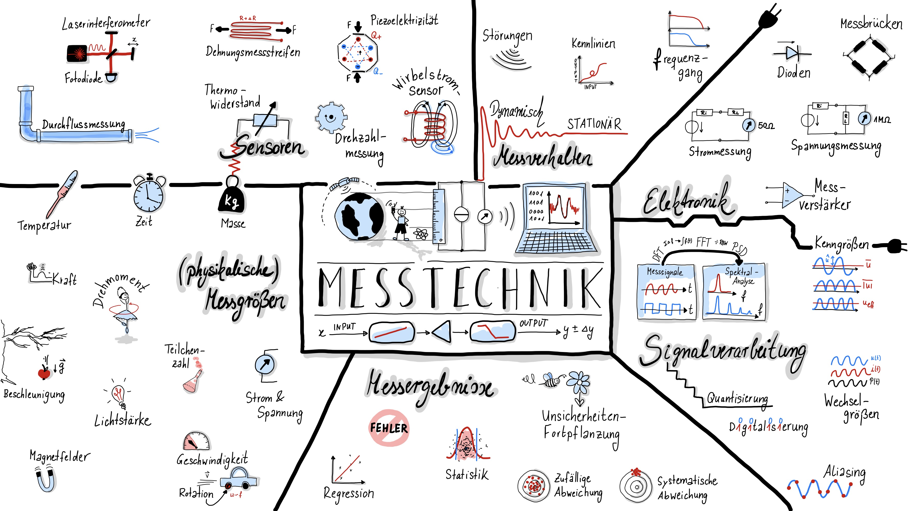

# Vorlesungsskript Messtechnik
Interaktives Vorlesungsskript für die Veranstaltung Messtechnik an der Fakultät für Maschinenbau der Helmut-Schmidt-Universität, Universität der Bundeswehr von Dr. rer. nat. Katharina-Sophie Isleif, isleifk@hsu-hh.de

## Jupyter Notebooks
Dieses github-Repository beinhaltet eine Anzahl von [Jupyter](https://jupyter.org/) Notebooks, welche Notizen und Beispiele für das Bachelormodul Messtechnik an der Helmut-Schmidt-Universität Hamburg, Universität der Bundeswehr, gelesen von Katharina-Sophie Isleif, bereitstellt. Das Notebook beinhaltet Beispiele in der Programmiersprache [IPython 3](http://ipython.org/), welche auch interaktiv ausgeführt werden können. Eine kurze Anleitung zur Ausführung von Blocks und Code in Jupyter Notebooks kann im [Jupyter Notebook Tutorial](00_jupyter_notebook_tutorial.ipynb) gefunden werden. 

- [**Interaktive Kursmaterialien starten**](https://mybinder.org/v2/gh/Kisleif/messtechnik-lecture/HEAD?filepath=00_Inhalt.ipynb)
- [Kursmaterialien nur lesen](https://nbviewer.jupyter.org/github/Kisleif/messtechnik-lecture/blob/main/00_Inhalt.ipynb)
- [Installationshinweise & Grundlagen der Programmierung in Python (Github von Nils Fleischer für einen anderen Kurs)](https://nbviewer.jupyter.org/github/nilsleiffischer/python-course/blob/master/setup.ipynb)

## Inhalt
Der Inhalt dieses Vorlesungsskripts wird im laufenden Trimester entwickelt und erweitert. Gerne können Anmerkungen zu Fehlern oder Anregungen gemeldet werden, beispielsweise als [issues](https://github.com/Kisleif/messtechnik-lecture/issues) auf GitHub oder über direkte Kontaktaufnahme über isleifk@hsu-hh.de.

### Teil 1: Grundlagen
***
* [Einleitung: Einheiten, Kalibrieren und Eichen](Einleitung.ipynb)

### Teil 2: Messsysteme, Messsignale, Messabweichungen
***
* [Statische Messsysteme: Kennlinien](StatischeMesssysteme.ipynb)
* [Messabweichungen](Messabweichungen.ipynb)
* [Messsignale](Messsignale.ipynb)
* Messsignale analysieren
* Dynamische Messsysteme
* Messen elektrischer Größen 

### Teil 3: Sensoren
***
* Auswahl an Sensoren

## Literatur
* Parthier, R. (2020). Messtechnik: Vom SI-Einheitensystem über Bewertung von Messergebnissen zu Anwendungen der elektrischen Messtechnik (9th 2020 ed.). Wiesbaden: Springer Vieweg
* Böttcher, J. (2020). Kompendium Messtechnik und Sensorik: https://www.bod.de/buchshop/kompendium-messtechnik-und-sensorik-joerg-boettcher-9783752632491, www.unibw.de/regelungs-und-messtechnik
* Weiterführende Literatur: Puente León, F. (2019). Messtechnik: Grundlagen, Methoden und Anwendungen (11. Auflage). Springer Vieweg
* Weiterführende Literatur: Brian Douglas, Fundamentals of Control Theory, https://engineeringmedia.com
